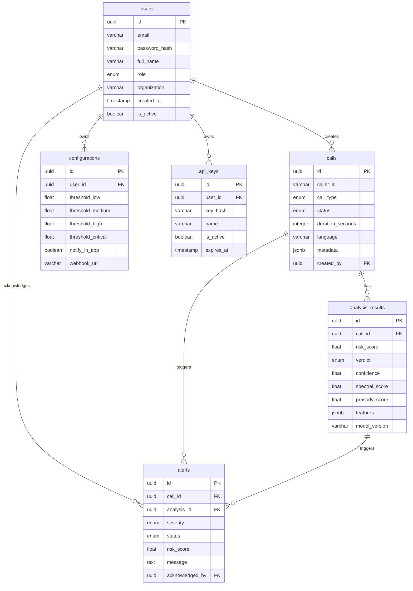

# Architecture — VoxGuard

## Tech Stack

| Layer | Technology | Functionality | Purpose |
|-------|-----------|---------------|---------|
| **Frontend** | Next.js (React) | Dashboard UI, real-time data display, user interactions | Server-side rendering, file-based routing, API routes as BFF proxy |
| **Styling** | Tailwind CSS | Utility-first CSS framework | Rapid, consistent UI styling without custom CSS bloat |
| **State Management** | Zustand / React Context | Client-side state for UI, auth, and WebSocket data | Lightweight, minimal boilerplate for real-time state updates |
| **Real-Time** | WebSocket (native / socket.io-client) | Bidirectional communication for live risk scores and alerts | Push-based updates for real-time call monitoring |
| **Charts / Viz** | Recharts / D3.js | Spectrogram rendering, risk score gauges, analytics charts | Data visualization for call analysis and dashboard |
| **Backend API** | Python (FastAPI) | REST API server, auth, business logic, alert routing | High-performance async Python framework, auto-generated OpenAPI docs |
| **ML Service** | Python (FastAPI) — separate microservice | Voice analysis inference, feature extraction, risk scoring | Isolated ML workload, independently scalable, GPU-ready |
| **ML Framework** | PyTorch | Lightweight MFCC MLP Classifier | Pre-extracts 40 MFCCs (mean pooled), 4-layer NN, optimized for real-time inference |
| **Audio Processing** | librosa, torchaudio | Audio loading, MFCC extraction, spectrogram generation | Feature extraction from audio streams and files |
| **Database** | PostgreSQL | Persistent storage for users, calls, alerts, configurations | Relational data with strong consistency and querying |
| **ORM** | SQLAlchemy (async) | Database abstraction layer | Type-safe queries, migrations, schema management |
| **Migrations** | Alembic | Database schema versioning | Controlled, reversible schema changes |
| **Auth** | JWT (PyJWT) | Token-based authentication | Stateless auth with access/refresh token pattern |
| **WebSocket Server** | FastAPI WebSocket / socket.io | Server-side real-time connection management | Push risk scores and alerts to connected dashboard clients |
| **Task Queue** | Celery + Redis (optional) | Background processing for batch audio analysis | Non-blocking processing of uploaded files |
| **Containerization** | Docker + Docker Compose | Multi-service orchestration | Consistent dev/demo environment across machines |

---

## ML Model Architecture

### Approach: Fine-tune wav2vec 2.0 on ASVspoof 2019 (LA)

```
Raw Audio Input (16kHz mono WAV)
        ↓
  ┌─────────────────────────────────┐
  │   wav2vec 2.0 Base Encoder      │   ← Pre-trained on LibriSpeech
  │   (frozen or partially frozen)  │
  │   Outputs: 768-dim embeddings   │
  └─────────────────────────────────┘
        ↓
  ┌─────────────────────────────────┐
  │   Classification Head           │
  │   Linear(768, 256) → ReLU      │
  │   Dropout(0.3)                  │
  │   Linear(256, 2)               │   ← [genuine, spoofed]
  │   Softmax                       │
  └─────────────────────────────────┘
        ↓
  Risk Score (0–100) + Verdict
```

### Dataset

- **ASVspoof 2019 LA (Logical Access)** subset
- Contains genuine speech + 17 spoofing attack types (TTS and voice conversion)
- Standard train/dev/eval splits
- Evaluation metric: Equal Error Rate (EER), target < 5%

### Feature Pipeline

| Feature | Extraction Method | Purpose |
|---------|------------------|---------|
| wav2vec embeddings | wav2vec 2.0 encoder | Deep learned speech representations |
| MFCCs | librosa.feature.mfcc | Traditional spectral features for prosody analysis |
| Spectral centroid | librosa | Frequency distribution analysis |
| Pitch contour | librosa.pyin | Prosody and intonation modeling |
| Zero crossing rate | librosa | Speech vs. noise discrimination |

---

## System Boundaries

```
┌─────────────────────────────────────────────────────────────────────┐
│                        VOXGUARD SYSTEM                              │
│                                                                     │
│  ┌──────────────┐    ┌──────────────────┐    ┌──────────────────┐  │
│  │              │    │                  │    │                  │  │
│  │   Frontend   │◄──►│   Backend API    │◄──►│   ML Service     │  │
│  │   (Next.js)  │    │   (FastAPI)      │    │   (FastAPI)      │  │
│  │              │    │                  │    │                  │  │
│  │   Port 3000  │    │   Port 8000      │    │   Port 8001      │  │
│  │              │    │                  │    │                  │  │
│  └──────────────┘    └────────┬─────────┘    └──────────────────┘  │
│         ▲                     │                       ▲             │
│         │                     ▼                       │             │
│         │              ┌──────────────┐               │             │
│         │              │  PostgreSQL   │               │             │
│         │              │  Port 5432   │               │             │
│         │              └──────────────┘               │             │
│         │                                             │             │
│         └─────────── WebSocket ──────────────────────┘             │
│                    (via Backend)                                    │
│                                                                     │
└─────────────────────────────────────────────────────────────────────┘

EXTERNAL (Out of System Boundary):
  • Actual telecom/VoIP networks (simulated)
  • Banking systems (mocked API)
  • SMS/Email delivery services (simulated in-app)
  • End-user mobile phones
```

### Boundary Rules

| Boundary | Inside | Outside |
|----------|--------|---------|
| **Audio Input** | Audio files uploaded via web UI; simulated live streams via WebSocket | Actual telephony trunks, SIP/VoIP gateways |
| **Alerting** | In-app notifications, UI prompts | Real SMS/email delivery (simulated) |
| **Banking Integration** | Mock API endpoints simulating bank responses | Actual core banking systems |
| **User Auth** | JWT-based login within VoxGuard | SSO/LDAP enterprise directory integration |
| **Data Storage** | PostgreSQL within Docker | Cloud-managed databases, data warehouses |

---

## Data Flow

### Flow 1: Real-Time Call Analysis

```
[Simulated Audio Stream]
        │
        ▼
[Frontend] ──WebSocket──► [Backend API]
                              │
                              │ Forward audio chunks
                              ▼
                         [ML Service]
                              │
                              ├─ Extract wav2vec embeddings
                              ├─ Compute MFCCs, pitch, spectral features
                              ├─ Run classification head
                              ├─ Compute risk score (0–100)
                              │
                              ▼
                    Risk Score + Features
                              │
                    ◄─── REST Response ───
                              │
                         [Backend API]
                              │
                              ├─ Store call record + scores in DB
                              ├─ Evaluate alert thresholds
                              ├─ If threshold exceeded → create Alert record
                              │
                              ▼
                    ──WebSocket Push──► [Frontend]
                                          │
                                          ├─ Update risk gauge
                                          ├─ Show alert notification
                                          └─ Update call feed
```

### Flow 2: Uploaded File Analysis

```
[User uploads .wav/.mp3] ──HTTP POST──► [Backend API]
                                            │
                                            ├─ Validate file format/size
                                            ├─ Store temporarily
                                            │
                                            ▼
                                       [ML Service]
                                            │
                                            ├─ Full file analysis
                                            ├─ Generate spectrogram
                                            ├─ Extract all features
                                            ├─ Compute verdict + risk score
                                            │
                                            ▼
                                      Analysis Result
                                            │
                                       [Backend API]
                                            │
                                            ├─ Store analysis record in DB
                                            ├─ Return full report to frontend
                                            │
                                            ▼
                                       [Frontend]
                                            │
                                            ├─ Render spectrogram
                                            ├─ Display feature scores
                                            └─ Show verdict card
```

### Flow 3: Authentication

```
[Login Form] ──POST /auth/login──► [Backend API]
                                       │
                                       ├─ Validate credentials against DB
                                       ├─ Generate JWT (access + refresh)
                                       │
                                       ▼
                                  JWT Tokens
                                       │
                              ◄── Response ───
                                       │
                                  [Frontend]
                                       │
                                       ├─ Store access token in memory
                                       ├─ Store refresh token in httpOnly cookie
                                       └─ Attach token to all subsequent requests
```

---

## Folder Structure

```
sih/
├── frontend/                          # Next.js frontend application
│   ├── public/                        # Static assets (images, fonts, icons)
│   ├── src/
│   │   ├── app/                       # Next.js App Router pages
│   │   │   ├── layout.tsx             # Root layout
│   │   │   ├── page.tsx               # Dashboard (home)
│   │   │   ├── analysis/
│   │   │   │   └── page.tsx           # Call analysis page
│   │   │   ├── alerts/
│   │   │   │   └── page.tsx           # Alert management page
│   │   │   ├── settings/
│   │   │   │   └── page.tsx           # Settings & configuration page
│   │   │   ├── api-docs/
│   │   │   │   └── page.tsx           # API documentation page
│   │   │   └── auth/
│   │   │       ├── login/
│   │   │       │   └── page.tsx       # Login page
│   │   │       └── register/
│   │   │           └── page.tsx       # Registration page
│   │   ├── components/                # Reusable UI components
│   │   │   ├── layout/               # Navbar, Sidebar, Footer
│   │   │   ├── dashboard/            # Dashboard-specific components
│   │   │   ├── analysis/             # Call analysis components
│   │   │   ├── alerts/               # Alert components
│   │   │   ├── settings/             # Settings components
│   │   │   └── common/               # Shared components (Button, Card, Badge, etc.)
│   │   ├── hooks/                     # Custom React hooks
│   │   ├── lib/                       # Utility functions, API client, WebSocket client
│   │   ├── stores/                    # Zustand state stores
│   │   ├── types/                     # TypeScript type definitions
│   │   └── styles/                    # Global CSS, Tailwind config
│   │       └── globals.css            # Global styles and CSS custom properties
│   ├── tailwind.config.ts             # Tailwind configuration
│   ├── next.config.js                 # Next.js configuration
│   ├── tsconfig.json                  # TypeScript configuration
│   └── package.json                   # Frontend dependencies
│
├── backend/                           # FastAPI backend API server
│   ├── app/
│   │   ├── main.py                    # FastAPI app entry point
│   │   ├── config.py                  # Environment configuration
│   │   ├── database.py                # Database connection and session management
│   │   ├── models/                    # SQLAlchemy ORM models
│   │   │   ├── user.py
│   │   │   ├── call.py
│   │   │   ├── alert.py
│   │   │   └── configuration.py
│   │   ├── schemas/                   # Pydantic request/response schemas
│   │   │   ├── user.py
│   │   │   ├── call.py
│   │   │   ├── alert.py
│   │   │   └── analysis.py
│   │   ├── routers/                   # API route handlers
│   │   │   ├── auth.py
│   │   │   ├── calls.py
│   │   │   ├── alerts.py
│   │   │   ├── analysis.py
│   │   │   ├── settings.py
│   │   │   └── websocket.py
│   │   ├── services/                  # Business logic layer
│   │   │   ├── auth_service.py
│   │   │   ├── call_service.py
│   │   │   ├── alert_service.py
│   │   │   └── ml_client.py          # HTTP client to ML service
│   │   ├── middleware/                # Auth middleware, CORS, logging
│   │   └── utils/                     # Helper utilities
│   ├── alembic/                       # Database migration scripts
│   ├── requirements.txt               # Python dependencies
│   └── Dockerfile                     # Backend container definition
│
├── ml-service/                        # ML inference microservice
│   ├── app/
│   │   ├── main.py                    # FastAPI app for ML endpoints
│   │   ├── config.py                  # Model paths, thresholds, device config
│   │   ├── models/                    # Model loading and management
│   │   │   ├── wav2vec_classifier.py  # wav2vec 2.0 + classification head
│   │   │   └── model_loader.py       # Model initialization and caching
│   │   ├── features/                  # Feature extraction modules
│   │   │   ├── audio_processor.py     # Audio loading, resampling, normalization
│   │   │   ├── spectral.py           # Spectrogram, MFCC, spectral features
│   │   │   ├── prosody.py            # Pitch, rhythm, pause analysis
│   │   │   └── embeddings.py         # wav2vec embedding extraction
│   │   ├── analysis/                  # Analysis pipeline
│   │   │   ├── pipeline.py           # End-to-end analysis orchestration
│   │   │   └── risk_scorer.py        # Risk score computation logic
│   │   ├── routers/                   # API endpoints
│   │   │   ├── analyze.py            # /analyze endpoint (file upload)
│   │   │   └── stream.py             # /stream endpoint (real-time chunks)
│   │   └── utils/                     # Audio utilities, format conversion
│   ├── models/                        # Saved model weights (git-ignored)
│   │   └── .gitkeep
│   ├── training/                      # Training scripts (not part of runtime)
│   │   ├── train.py                   # Fine-tuning script
│   │   ├── evaluate.py                # Evaluation and metrics
│   │   ├── dataset.py                 # ASVspoof dataset loader
│   │   └── config.yaml               # Training hyperparameters
│   ├── requirements.txt               # ML Python dependencies
│   └── Dockerfile                     # ML service container definition
│
├── docker-compose.yml                 # Multi-service orchestration
├── .env.example                       # Environment variable template
├── .gitignore                         # Git ignore rules
├── README.md                          # Project README
│
└── context/                           # Project context files (this directory)
    ├── Project-overview.md
    ├── Architecture.md
    ├── Build-plan.md
    ├── Library-docs.md
    ├── Code-Standards.md
    ├── UI-tokens.md
    ├── UI-rules.md
    ├── UI-registry.md
    └── Progress-tracker.md
```

---

## Database Schema

### Tables

#### `users`

| Column | Type | Constraints | Description |
|--------|------|-------------|-------------|
| id | UUID | PK, default uuid4 | Unique user identifier |
| email | VARCHAR(255) | UNIQUE, NOT NULL | User email address |
| password_hash | VARCHAR(255) | NOT NULL | Bcrypt hashed password |
| full_name | VARCHAR(255) | NOT NULL | User's display name |
| role | ENUM('admin', 'analyst', 'viewer') | NOT NULL, default 'analyst' | Access role |
| organization | VARCHAR(255) | NULLABLE | Organization name |
| created_at | TIMESTAMP | NOT NULL, default now() | Account creation time |
| updated_at | TIMESTAMP | NOT NULL, auto-update | Last modification time |
| is_active | BOOLEAN | NOT NULL, default true | Account active status |

#### `calls`

| Column | Type | Constraints | Description |
|--------|------|-------------|-------------|
| id | UUID | PK, default uuid4 | Unique call identifier |
| caller_id | VARCHAR(50) | NULLABLE | Caller phone number or identifier |
| caller_name | VARCHAR(255) | NULLABLE | Caller display name (if known) |
| call_type | ENUM('live', 'uploaded') | NOT NULL | How the audio was received |
| status | ENUM('active', 'completed', 'flagged') | NOT NULL | Call processing status |
| duration_seconds | INTEGER | NULLABLE | Call duration in seconds |
| audio_file_path | VARCHAR(500) | NULLABLE | Path to stored audio file |
| language | VARCHAR(50) | NULLABLE | Detected language/accent |
| metadata | JSONB | NULLABLE | Additional call context (origin, contact info) |
| created_at | TIMESTAMP | NOT NULL, default now() | Call start time |
| completed_at | TIMESTAMP | NULLABLE | Call end time |
| created_by | UUID | FK → users.id | User who initiated the analysis |

#### `analysis_results`

| Column | Type | Constraints | Description |
|--------|------|-------------|-------------|
| id | UUID | PK, default uuid4 | Unique analysis identifier |
| call_id | UUID | FK → calls.id, NOT NULL | Associated call |
| risk_score | FLOAT | NOT NULL, range 0–100 | Overall impersonation risk score |
| verdict | ENUM('genuine', 'suspicious', 'cloned') | NOT NULL | Classification verdict |
| confidence | FLOAT | NOT NULL, range 0–1 | Model confidence in verdict |
| spectral_score | FLOAT | NULLABLE | Spectral analysis sub-score |
| prosody_score | FLOAT | NULLABLE | Prosody analysis sub-score |
| consistency_score | FLOAT | NULLABLE | Cross-session consistency sub-score |
| features | JSONB | NULLABLE | Extracted feature vector (anonymized) |
| spectrogram_path | VARCHAR(500) | NULLABLE | Path to generated spectrogram image |
| processing_time_ms | INTEGER | NULLABLE | Time taken for analysis |
| model_version | VARCHAR(50) | NOT NULL | Model version used for analysis |
| created_at | TIMESTAMP | NOT NULL, default now() | Analysis timestamp |

#### `alerts`

| Column | Type | Constraints | Description |
|--------|------|-------------|-------------|
| id | UUID | PK, default uuid4 | Unique alert identifier |
| call_id | UUID | FK → calls.id, NOT NULL | Associated call |
| analysis_id | UUID | FK → analysis_results.id, NOT NULL | Triggering analysis |
| severity | ENUM('low', 'medium', 'high', 'critical') | NOT NULL | Alert severity level |
| status | ENUM('open', 'acknowledged', 'resolved', 'false_positive') | NOT NULL, default 'open' | Alert lifecycle status |
| risk_score | FLOAT | NOT NULL | Risk score at time of alert |
| message | TEXT | NOT NULL | Human-readable alert description |
| recommended_action | TEXT | NULLABLE | Suggested verification step |
| acknowledged_by | UUID | FK → users.id, NULLABLE | User who acknowledged |
| resolved_by | UUID | FK → users.id, NULLABLE | User who resolved |
| created_at | TIMESTAMP | NOT NULL, default now() | Alert creation time |
| updated_at | TIMESTAMP | NOT NULL, auto-update | Last status change |

#### `configurations`

| Column | Type | Constraints | Description |
|--------|------|-------------|-------------|
| id | UUID | PK, default uuid4 | Unique config identifier |
| user_id | UUID | FK → users.id, NOT NULL | Config owner |
| threshold_low | FLOAT | NOT NULL, default 25.0 | Low risk threshold |
| threshold_medium | FLOAT | NOT NULL, default 50.0 | Medium risk threshold |
| threshold_high | FLOAT | NOT NULL, default 75.0 | High risk threshold |
| threshold_critical | FLOAT | NOT NULL, default 90.0 | Critical risk threshold |
| notify_in_app | BOOLEAN | NOT NULL, default true | In-app notification toggle |
| notify_email | BOOLEAN | NOT NULL, default false | Email notification toggle |
| notify_sms | BOOLEAN | NOT NULL, default false | SMS notification toggle |
| webhook_url | VARCHAR(500) | NULLABLE | External webhook endpoint |
| auto_escalate | BOOLEAN | NOT NULL, default false | Auto-escalate critical alerts |
| created_at | TIMESTAMP | NOT NULL, default now() | Config creation time |
| updated_at | TIMESTAMP | NOT NULL, auto-update | Last modification time |

#### `api_keys`

| Column | Type | Constraints | Description |
|--------|------|-------------|-------------|
| id | UUID | PK, default uuid4 | Unique API key identifier |
| user_id | UUID | FK → users.id, NOT NULL | Key owner |
| key_hash | VARCHAR(255) | NOT NULL, UNIQUE | Hashed API key |
| key_prefix | VARCHAR(10) | NOT NULL | First 8 chars for identification |
| name | VARCHAR(100) | NOT NULL | Human-readable key name |
| is_active | BOOLEAN | NOT NULL, default true | Key active status |
| last_used_at | TIMESTAMP | NULLABLE | Last usage timestamp |
| expires_at | TIMESTAMP | NULLABLE | Expiration timestamp |
| created_at | TIMESTAMP | NOT NULL, default now() | Key creation time |

### ER Diagram



---
